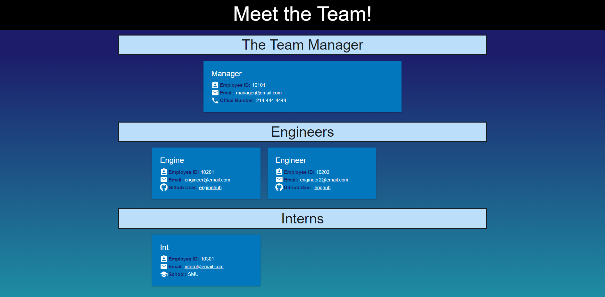

# TeamProfileGenerator

## Table of Contents

1. [Description](#Description)
2. [Criteria](#Criteria)
3. [Installation](#Installation)
4. [Usage](#Usage)
5. [Contributing](#Contributing)
6. [Issues](#Issues)
7. [License](#License)
8. [Tests](#Tests)
9. [Questions](#Questions)

## Description

In this assignment, we were tasked with creating an application in which the user answers multiple prompts for information and depending on the choices they make, they can enter as many of a certain kind of information as they wish. The information the user provides is then used to create an HTML page displaying a team profile filled out with that information.

I struggled with figuring out how to connect the inquirer prompts the most on this one. I wound up referencing from other github users that had done the assignment in the past to see how they achieved it. It seems using too many .then is not your friend! Once I had that figured out, the next challenge for me was figuring out how to access the information I needed from the array of objects I had created. After doing some research on keys, I figured out how to do so. It was definitely a challenge, though.

Another one of the difficult things for me is testing these sort of applications. Repeatedly putting in so much information to see if one little thing worked or didn't is a pain. I think if I had more time, I would figure out a way to tell the application that after a certain number of cards, it needs to make a new row. It works as it is now, but it could be better.

Unable to be deployed.

[Link to video demonstration](https://drive.google.com/file/d/1dm17YhVTJs1on8KHUR1b8P7QOSK03mH9/view)

Example picture:

## Criteria

GIVEN a command-line application that accepts user input

WHEN I am prompted for my team members and their information

THEN an HTML file is generated that displays a nicely formatted team roster based on user input

    * Used Inquirer to gather information and fs.writeFile to create the HTML file with the information

WHEN I click on an email address in the HTML

THEN my default email program opens and populates the TO field of the email with the address

    * Used an anchor tag linked to mailto: and email variable
    
    * Allows it to be clicked on and open in the local email application

WHEN I click on the GitHub username

THEN that GitHub profile opens in a new tab

    * Used an anchor tag with the url and the github variable to link to the github

WHEN I start the application

THEN I am prompted to enter the team manager’s name, employee ID, email address, and office number

    * On initialization, runs a function that prompts the user for the manager's information.

WHEN I enter the team manager’s name, employee ID, email address, and office number

THEN I am presented with a menu with the option to add an engineer or an intern or to finish building my team

    * After the manager's prompt, it runs a function prompting the user if they want to add another team member

    * Runs another function depending on the response

WHEN I select the engineer option

THEN I am prompted to enter the engineer’s name, ID, email, and GitHub username, and I am taken back to the menu

    * When choosing engineer, it will run a function to prompt for the engineer's information

WHEN I select the intern option

THEN I am prompted to enter the intern’s name, ID, email, and school, and I am taken back to the menu

    * When choosing intern, it will run a function to prompt for the intern's information

WHEN I decide to finish building my team

THEN I exit the application, and the HTML is generated

    * When choosing I'm done adding team members, the application runs a function
    
    * The function generates the HTML and writes the file.

## Installation

Files must be downloaded from Github. Then, run npm install to get the necessary node modules. Last, run node index.js.

## Usage

This is an application in which the user answers multiple questions in the terminal and the answers are then used to populate an HTML file.

## Contributing

For contributions, please create a fork to work on then, when done, create a Pull Request.

## Issues

Submit an Issue through Github for any bugs or problems.

## License

Copyright Ashley Wright 2021

This is covered under the <a href='https://opensource.org/licenses/MIT'>MIT</a> license.

## Tests

Jest

## Questions

Feel free to contact through the following with any questions:

Email: ashleyaggie@aol.com

Github: <a href='https://github.com/ashleyaggie'>ashleyaggie</a>